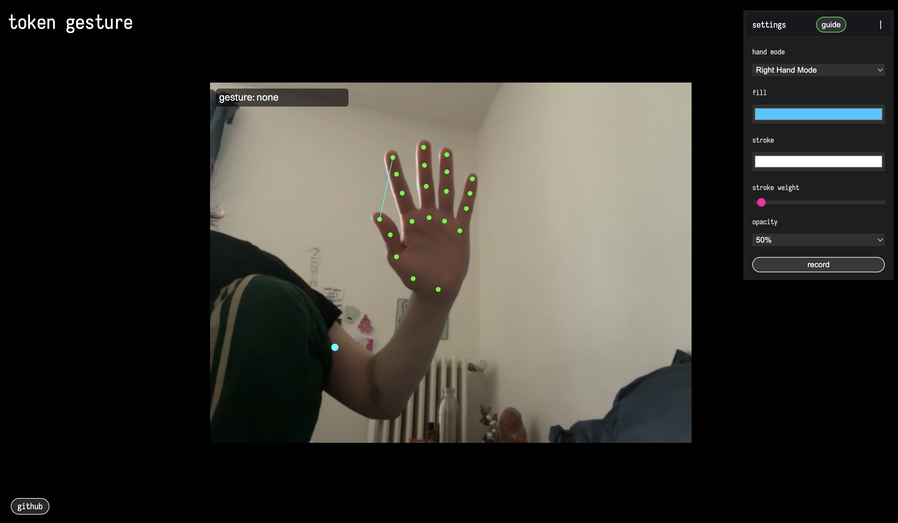
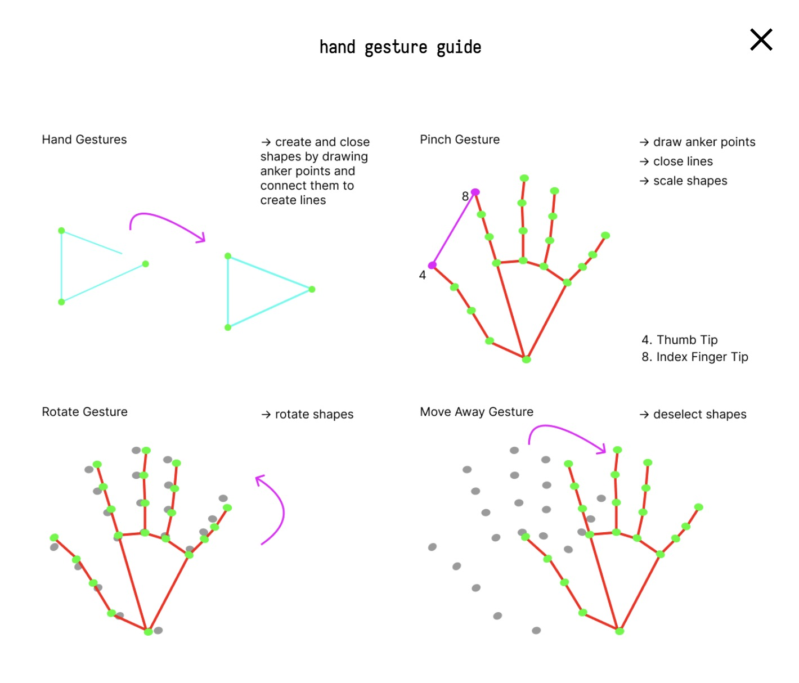

# token-gesture
Token gesture let's you draw and animate shapes with hand gestures. The hands are being tracked with the ml5 open-source handpose machine learning model. This is the source code of the tool. 

try the tool here: https://token-gesture.moduldesign.online/

## preview

## guide 

